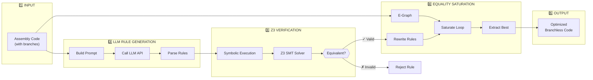

# LLM + Equality Saturation: How the Loop Works

This document explains exactly how the LLM and Equality Saturation work together in Learn-R, using the **Signum optimization** as a running example.

---

## The Big Picture



---

## Step-by-Step Walkthrough with Signum Example

### 📥 Step 1: The Input (Branchy Signum)

Consider this classic signum function that uses branches:

```asm
; Signum: returns 1 if x > 0, -1 if x < 0, 0 if x == 0
signum:
    cmp edi, 0        ; Compare input with 0
    jle .negative     ; Jump if x <= 0
    mov eax, 1        ; x > 0: return 1
    jmp .done
.negative:
    mov eax, -1       ; x <= 0: return -1  
.done:
    ret
```

**Problem**: This has 2 jumps (`jle`, `jmp`) which cause pipeline stalls.

---

### 🤖 Step 2: LLM Rule Generation

#### 2a. Build the Prompt

The system constructs a prompt asking the LLM for branchless transformations.

**File**: `learned_rules/llm_rule_generator.py` → `generate_candidate_rules()`

```python
# Lines 481-553
prompt = f"""You are a Compiler Optimization expert specializing in x86-64 assembly.
Your goal is to generate "Rewrite Rules" that transform inefficient code into high-performance machine code.

Given the following assembly instruction sequence:

{instruction_text}

CRITICAL INSTRUCTIONS:

1. PRIORITIZE BRANCHLESS LOGIC: The highest value optimizations remove 'jle', 'jge', 'jmp' and replace them with:
   - 'cmov' (Conditional Move): cmovg, cmovl, cmove, cmovne
   - 'set' (Set Byte): setne, sete, setg, setl
   - 'neg' (Negate)
   - 'sbb' (Subtract with Borrow)
   - 'test' (Efficient comparison against 0)

EXAMPLE OF A GOOD RULE (Branchless Signum):
Name: "branch_to_cmov"
LHS:
  cmp src, 0
  jle Label_A
  mov dst, 1
  jmp Label_B
  Label_A:
  mov dst, -1
  Label_B:
RHS:
  xor eax, eax    ; Clear temp
  test src, src   ; Check sign/zero
  mov edx, 1      ; Load positive case
  setne al        ; Set if not zero
  neg eax         ; -1 if set
  cmovg eax, edx  ; Move 1 if greater than 0
"""
```

#### 2b. Call LLM API

**File**: `learned_rules/llm_rule_generator.py` → `call_llm_api()`

```python
# Lines 381-460
def call_llm_api(prompt: str, provider: str = None, ...) -> str:
    """
    Call an LLM API to generate rewrite rules.
    Supports multiple providers with automatic retry on rate limits.
    """
    provider = (provider or config.llm_provider).lower()
    
    # Map provider to call function
    provider_funcs = {
        "openai": _call_openai,
        "anthropic": _call_anthropic,
        "google": _call_google,
        "lmstudio": _call_lmstudio,
        "huggingface": _call_huggingface,
    }
    
    call_func = provider_funcs.get(provider)
    response = call_func(prompt)  # <-- Actual LLM call
    
    return response
```

**The LLM returns something like:**

```text
Rule: branch_to_cmov
LHS:
  cmp src, 0
  jle Label_A
  mov dst, 1
  jmp Label_B
  Label_A:
  mov dst, -1
  Label_B:
RHS:
  xor eax, eax
  test src, src
  mov edx, 1
  setne al
  neg eax
  test src, src
  cmovg eax, edx
Condition: dst can be clobbered; eax, edx available as scratch
```

#### 2c. Parse the LLM Output

**File**: `learned_rules/rule_parser.py` → `parse_llm_output()`

```python
# Lines 25-104
def parse_llm_output(raw_text: str) -> list[ParsedRule]:
    """
    Parse LLM-generated text into structured rewrite rules.
    """
    rules = []
    lines = raw_text.strip().split('\n')
    
    for line in lines:
        # Check for section markers
        if line.upper().startswith('LHS:'):
            current_rule = ParsedRule()
            current_section = 'lhs'
        elif line.upper().startswith('RHS:'):
            current_section = 'rhs'
        elif line.upper().startswith('CONDITION:'):
            condition_text = line[10:].strip()
            current_rule.conditions.append(condition_text)
        else:
            # Add instruction to current section
            if current_section == 'lhs':
                current_rule.lhs_seq.append(line)
            elif current_section == 'rhs':
                current_rule.rhs_seq.append(line)
    
    return rules
```

**Output**: `ParsedRule` object:
```python
ParsedRule(
    lhs_seq=['cmp src, 0', 'jle Label_A', 'mov dst, 1', 'jmp Label_B', ...],
    rhs_seq=['xor eax, eax', 'test src, src', 'mov edx, 1', 'setne al', ...],
    conditions=['dst can be clobbered; eax, edx available as scratch']
)
```

---

### ✅ Step 3: Z3 Verification (The Guard)

This is where we **mathematically prove** the rule is correct.

#### 3a. Convert to Instruction Objects

**File**: `verification/rule_verifier.py` → `verify_rule()`

```python
# Lines 119-161
def verify_rule(parsed_rule: ParsedRule, timeout_ms: int = 5000, ...) -> bool:
    """
    Verify that a parsed rule is semantically correct using SMT.
    """
    # Convert LHS strings to Instruction objects
    lhs_instrs = []
    for instr_str in parsed_rule.lhs_seq:
        instr = parse_instruction_string(instr_str)
        lhs_instrs.append(instr)
    
    # Convert RHS strings to Instruction objects
    rhs_instrs = []
    for instr_str in parsed_rule.rhs_seq:
        instr = parse_instruction_string(instr_str)
        rhs_instrs.append(instr)
    
    # Check equivalence using Z3
    return are_sequences_equivalent(lhs_instrs, rhs_instrs, timeout_ms)
```

#### 3b. Symbolic Execution

**File**: `verification/equivalence_checker.py` → `are_sequences_equivalent()`

```python
# Lines 18-85
def are_sequences_equivalent(lhs_seq: List[Instruction], 
                            rhs_seq: List[Instruction],
                            timeout_ms: int = 5000) -> bool:
    """
    Check if two instruction sequences are semantically equivalent.
    
    Uses SMT solving to verify that both sequences produce the same
    final state for ALL possible initial states.
    """
    # Create initial symbolic state (shared by both sequences)
    initial_state = SymbolicState(prefix="init_")
    
    # Execute both sequences symbolically
    state_lhs = execute_sequence(lhs_seq, initial_state)
    state_rhs = execute_sequence(rhs_seq, initial_state)
    
    # Build constraints: find if there's ANY difference
    differences = []
    
    # Check all registers
    for reg in initial_state.registers:
        differences.append(state_lhs.registers[reg] != state_rhs.registers[reg])
    
    # Check all flags
    for flag in initial_state.flags:
        differences.append(state_lhs.flags[flag] != state_rhs.flags[flag])
    
    # Create Z3 solver
    solver = Solver()
    solver.set("timeout", timeout_ms)
    
    # Assert: Is there ANY input where states differ?
    solver.add(Or(*differences))
    
    # Check satisfiability
    result = solver.check()
    
    if result == sat:
        # Found a counterexample where states differ → NOT EQUIVALENT
        return False
    else:
        # UNSAT means no counterexample exists → EQUIVALENT ✓
        return True
```

**The Key Insight:**

```
LHS (Branchy):                    RHS (Branchless):
┌─────────────────────┐          ┌─────────────────────┐
│ cmp src, 0          │          │ xor eax, eax        │
│ jle Label_A         │          │ test src, src       │
│ mov dst, 1          │  ═══?═══ │ mov edx, 1          │
│ jmp Label_B         │          │ setne al            │
│ Label_A:            │          │ neg eax             │
│ mov dst, -1         │          │ cmovg eax, edx      │
└─────────────────────┘          └─────────────────────┘
         ↓                                ↓
    SymbolicState                  SymbolicState
    (after execution)              (after execution)
         ↓                                ↓
┌─────────────────────┐          ┌─────────────────────┐
│ eax = if src > 0    │          │ eax = if src > 0    │
│       then 1        │    ==    │       then 1        │
│       else -1       │          │       else ...      │
└─────────────────────┘          └─────────────────────┘

Z3 proves: ∀ src. LHS_output(src) = RHS_output(src)
```

---

### 🔄 Step 4: Equality Saturation (The Core Loop)

Now the verified rule enters the E-Graph.

#### 4a. Convert Rule to Egglog Format

**File**: `learned_rules/rule_to_egglog.py` → `RuleToEgglogConverter.convert_rule()`

```python
# Lines 117-175
def convert_rule(self, parsed_rule: "ParsedRule", verify: bool = None) -> Optional[EgglogRule]:
    """
    Convert a ParsedRule to an EgglogRule.
    """
    # Verify with Z3 first
    if verify and VERIFICATION_AVAILABLE:
        is_valid = verify_rule(parsed_rule)
        if not is_valid:
            return None  # REJECT - Z3 said no!
    
    # Parse LHS instructions to expression
    lhs_expr = self._parse_instructions_to_expr(parsed_rule.lhs_seq)
    
    # Parse RHS instructions to expression  
    rhs_expr = self._parse_instructions_to_expr(parsed_rule.rhs_seq)
    
    return EgglogRule(
        name=f"llm_rule_{self._rule_counter}",
        lhs_expr=lhs_expr,
        rhs_expr=rhs_expr,
        bidirectional=False,
        verified=True
    )
```

#### 4b. Add to E-Graph and Saturate

**File**: `egraph_bridge/egglog_pipeline.py` → `EqualitySaturationPipeline.optimize()`

```python
# Lines 267-309
def optimize(self) -> OptimizationResult:
    """
    Run the full optimization pipeline.
    """
    # Store original expressions
    original = {name: expr for name, expr in self._expressions.items()}
    
    # ═══════════════════════════════════════════════════════
    # 🔑 KEY STEP: Add LLM rules to e-graph
    # ═══════════════════════════════════════════════════════
    for rule in self._llm_rules:
        self._egraph.add_rule(rule.lhs_expr, rule.rhs_expr, rule.bidirectional)
    
    # ═══════════════════════════════════════════════════════
    # 🔑 KEY STEP: Run saturation loop
    # ═══════════════════════════════════════════════════════
    stats = self._egraph.saturate(self._max_iterations)
    
    # ═══════════════════════════════════════════════════════
    # 🔑 KEY STEP: Extract optimized expressions
    # ═══════════════════════════════════════════════════════
    optimized = {}
    for name, expr in self._expressions.items():
        optimized[name] = self._egraph.extract(expr)
    
    return OptimizationResult(
        original_expressions=original,
        optimized_expressions=optimized,
        ...
    )
```

#### 4c. The Saturation Loop Internals

**File**: `egraph_bridge/egg_egraph.py` → `EggEGraph.saturate()`

```python
# Lines 403-440
def saturate(self, max_iterations: int = 10) -> Dict[str, Any]:
    """
    Run equality saturation with all configured rules.
    """
    # Collect all rules
    all_rules = []
    all_rules.extend(create_algebraic_rules())    # x + 0 → x, etc.
    all_rules.extend(self._custom_rules)          # LLM-generated rules!
    
    if self._use_strength_reduction:
        all_rules.extend(create_strength_reduction_rules())  # x * 2 → x << 1
    
    # Register rules with the e-graph
    self._egraph.register(*all_rules)
    
    # ═══════════════════════════════════════════════════════
    # 🔑 THE SATURATION LOOP
    # ═══════════════════════════════════════════════════════
    self._egraph.run(max_iterations)  # ← This is where the magic happens
    
    # The e-graph now contains ALL equivalent forms!
```

**What happens inside `run()`:**

```
Iteration 1:
┌─────────────────────────────────────────────────────────────────┐
│                         E-GRAPH                                  │
├─────────────────────────────────────────────────────────────────┤
│                                                                  │
│  E-Class 1: [signum_branchy]                                    │
│                                                                  │
│  Rule "x + 0 → x" matches?  NO                                  │
│  Rule "x * 2 → x << 1" matches?  NO                             │
│  Rule "branch_to_cmov" matches?  YES! ←────────────────────────┐│
│                                                                 ││
└─────────────────────────────────────────────────────────────────┘│
                                                                   │
Iteration 2 (after rule applied):                                  │
┌─────────────────────────────────────────────────────────────────┐│
│                         E-GRAPH                                  ││
├─────────────────────────────────────────────────────────────────┤│
│                                                                  ││
│  E-Class 1: [signum_branchy] ←──────── MERGED ──────→ [signum_branchless]
│             ↑                                            ↑      │
│    Original code                              LLM-generated code│
│    (with jumps)                               (cmov/setne)      │
│                                                                  │
│  BOTH ARE NOW IN THE SAME EQUIVALENCE CLASS!                    │
│                                                                  │
└─────────────────────────────────────────────────────────────────┘

Iteration 3, 4, ...N:
  Keep applying rules until no new equivalences found (SATURATED)
```

#### 4d. Cost-Based Extraction

After saturation, we have MANY equivalent forms. We need to pick the "best" one.

**File**: `egraph_bridge/egg_egraph.py` → `EggEGraph.extract()`

```python
# Lines 442-455
def extract(self, expr: Any) -> Any:
    """
    Extract the optimal representation of an expression.
    Uses egglog's cost-based extraction.
    """
    return self._egraph.extract(expr)
```

The cost model prefers:
- **Fewer instructions** (shorter is better)
- **No branches** (jumps are expensive)
- **Simple operations** (shifts over multiplies)

So from the E-Class containing both:
```
E-Class 1: { signum_branchy, signum_branchless }
                   ↓
            EXTRACT picks:
                   ↓
            signum_branchless  (lower cost!)
```

---

### 📤 Step 5: The Output

```asm
; BEFORE (branchy):        ; AFTER (branchless):
cmp edi, 0                 xor eax, eax
jle .negative              test edi, edi
mov eax, 1                 mov edx, 1
jmp .done                  setne al
.negative:                 neg eax
mov eax, -1                test edi, edi
.done:                     cmovg eax, edx
ret                        ret
```

**Benefits:**
- ❌ 0 branches (was 2)
- ✓ No pipeline stalls
- ✓ Predictable execution time
- ✓ Same semantics (verified by Z3!)

---

## Summary: The Complete Flow

```
┌───────────────────────────────────────────────────────────────────────┐
│                    LLM + EQUALITY SATURATION LOOP                     │
├───────────────────────────────────────────────────────────────────────┤
│                                                                       │
│  1. INPUT: Assembly with branches                                     │
│       ↓                                                               │
│  2. LLM GENERATION:                                                   │
│       • Build optimization prompt                                     │
│       • Call LLM (OpenAI/Anthropic/Gemini)                           │
│       • Parse response → ParsedRule objects                          │
│       ↓                                                               │
│  3. Z3 VERIFICATION:                                                  │
│       • Symbolic execute LHS and RHS                                  │
│       • Ask Z3: "∃ input where LHS ≠ RHS?"                           │
│       • If SAT → Reject (found counterexample)                       │
│       • If UNSAT → Accept (proven equivalent!)                       │
│       ↓                                                               │
│  4. EQUALITY SATURATION:                                              │
│       • Add verified LLM rules to E-Graph                            │
│       • Loop: Apply all rules until saturated                        │
│       • KEY: Both forms exist simultaneously in E-Graph              │
│       • Extract: Pick lowest-cost equivalent                         │
│       ↓                                                               │
│  5. OUTPUT: Optimized branchless assembly                            │
│                                                                       │
└───────────────────────────────────────────────────────────────────────┘
```

---

## Key Files Reference

| Component | File | Key Function |
|-----------|------|--------------|
| LLM Prompt | `learned_rules/llm_rule_generator.py` | `generate_candidate_rules()` |
| LLM API Call | `learned_rules/llm_rule_generator.py` | `call_llm_api()` |
| Parse LLM Output | `learned_rules/rule_parser.py` | `parse_llm_output()` |
| Z3 Verification | `verification/rule_verifier.py` | `verify_rule()` |
| Symbolic Execution | `verification/symbolic_executor.py` | `execute_sequence()` |
| Equivalence Check | `verification/equivalence_checker.py` | `are_sequences_equivalent()` |
| Convert to Egglog | `learned_rules/rule_to_egglog.py` | `RuleToEgglogConverter.convert_rule()` |
| E-Graph Saturation | `egraph_bridge/egg_egraph.py` | `EggEGraph.saturate()` |
| Cost Extraction | `egraph_bridge/egg_egraph.py` | `EggEGraph.extract()` |
| Full Pipeline | `egraph_bridge/egglog_pipeline.py` | `EqualitySaturationPipeline.optimize()` |
| CLI Entry Point | `run_pipeline.py` | `run_pipeline()` |

---

## The Crucial Insight

> **Equality Saturation DOES NOT DELETE the original.**
> 
> It ADDS the optimized version and LINKS them as equivalent.
> Both `signum_branchy` and `signum_branchless` exist in the same E-Class.
> Only at the END does extraction pick the best one.

This is fundamentally different from traditional rewriting:
- Traditional: `x * 2` deleted, replaced with `x << 1`
- E-Graph: Both exist, linked as equivalent, cost model picks winner
